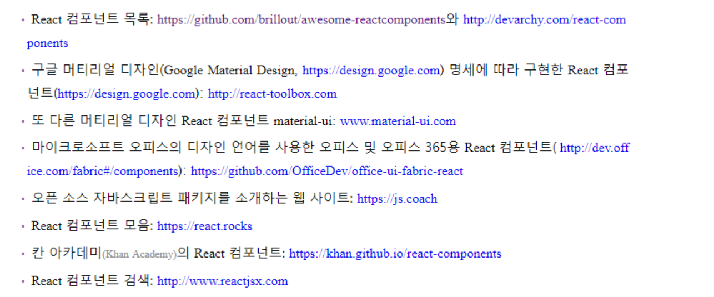

# React 살펴보기

- React는 내부적으로 가상 DOM을 사용하여 브라우저에 이미 반영된 뷰와 새로운 뷰의 차이점을 찾아낸다. 개발자는 명시적으로 뷰를 변경하려고 노력할 필요가 없다.
→ jQuery를 사용하면 이런 갱신과정을 명령형으로 작성해야한다.
- jQuery나 AngularJS가 선택한 방식은 극단적이다. jQuery 방식을 선택하면 실수가 잦아지고, 더 많은 노력을 들여야한다. AngularJS의 양방향 데이터 바인딩은 금세 통제하기 어려운 상태가 되므로 코드를 잘 설명하기 어렵다.
- React의 폭넓은 개발 커뮤니티와 생태계

    

- Backbone, Ember, AngularJS 같은 프레임워크보다는 dom 조작을 위한 라이브러리에 가깝다.
- JSX를 사용하려면 Babel같은 트랜스 컴파일러를 사용해야한다.
- JSX에서의 if/else 처리(삼항연산자)

```jsx
render(){
	return <div>
		{(this.props.user.session)
			? <a href='/logout'>Logout</a>
			: <a href='/login'>Login</a>}
	</div>
}
```

- JX의 스타일은 일반적인 HTML과 다르게 동작한다. CSS 속성은 카멜 표기법으로 작성한다.
→ background-image는 backgroundImage로 작성한다.
→ font-size는 fontSize로 작성한다.
→ class대산 className으로 작성한다.