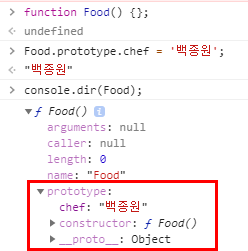
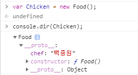
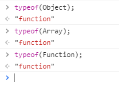

# Prototype 파헤치기

자바스크립트는 Prototype 기반 객체지향 언어입니다.

ES6에서 Class 문법이 추가되긴 했지만 Java에서 말하는 Class가 아니닌 Prototype을 기반으로 하여 만들어진 문법입니다.

Prototype에 대해 파헤쳐볼 필요가 있을 것 같습니다.

우리가 Prototype에 대해서 알고있는 정보는 다음과 같습니다.

"프로토 타입이란 원형 객체를 공유하는 것을 뜻하고, 불필요한 메모리 낭비를 방지할 수 있다."

사용법만 알고 있는게 아니라 어떻게? 에 집중해봅시다.

```jsx
function Phone(name, price) {
   this.name = name;
   this.price= price;
}

Phone.prototype.alertPromotion = function() {
  alert(`My name is ${this.name}!!`);
}

var samsung = new Phone("Galaxy S99", "156");
samsung.alertPromotion();   // My name is Galaxy S99!!

```

# ✅ Prototype

### 자바스크립트에서는 원시값을 제외하고는 모두 객체(Object)입니다.

먼저  `**객체는 함수로부터 시작된다`** 라는 것을 알아야합니다.

자바스크립트 엔진은 다음과 같이 해석합니다.

```jsx
var Car = {};
var Car = new Object{};

var Food = ['Chicken', 'Pizza'];
var Food = new Array('Chicken', 'Pizza');
```

따라서  리터럴 방식으로 객체를 생성할때도 Object라는 함수(생성자)를 통해 객체를 생성하게 됩니다.



### 함수 생성 시 발생하는 일

함수를 정의하면 함수가 생성되며 prototype object가 같이 생성됩니다. 

(함수 객체 생성시에만 생성되며 일반 객체는 생성되지 않습니다.)

prototype이라는 속성을 통해 prototype object에 접근할 수 있습니다.

아래와 같이 prototype object에 사용자 임의로 속성을 추가할 수 있습니다.

```jsx
function Food() {}
Food.prototype.name = "삼겹살";
Food.prototype.Hi = function () {
  alert(`Hello!`);
}
```



함수와 함께 생성된 Prototype object는 constructor와 __**proto**__를 가지고 있습니다.

constructor는 생성된 함수(객체)를 가리키며(function Food)

__**proto**__는 객체가 생성될 때 조상이었었던 함수의 Prototype object를 가리킵니다.(Prototype Link)

만약 Food라는 함수를 이용해 Chicken이라는 객체를 생성할 경우

Chicken의 __**proto**__는 Food의 Prototype object를 가리키게 됩니다.

### 객체 생성 시 발생하는 일

위에서 설명한 것과 같이 Food라는 함수를 이용하여 Chicken이라는 객체를 생성해보면 

__**proto**__ 속성이 보이는 것을 확인할 수 있습니다.



Chicken의 __**proto**__는 Food의 Prototype object를 가리키고 있습니다.

Chicken.chef 속성을 찾을 경우 Chicken 객체는 chef 속성을 직접 가지고 있지 않기 때문에 eyes 속성을 찾을때까지 상위 Prototype을 검색합니다.

최상위인 Object의 Prototype object까지 도달했는데도 못찾을 경우 undefined를 리턴합니다.

이렇게 __**proto**__속성을 통해 상위 Prototype과 연결되어있는 형태를 Prototype Chain(체인)이라고 합니다.

이러한 Prototype Chain구조 덕분에 모든 객체는 Object의 자식이라고 불리고 toString과 같은 Object Prototype Object에 있는 모든 속성을 사용할 수 있습니다.

### 마무리

이 내용은 아래 참조 사이트의 내용을 정리한 것입니다.

더 자세한 내용을 원하시면 참조 사이트를 읽어 보시는 것을 추천드립니다.

프로토타입 이해하기- https://medium.com/@bluesh55/javascript-prototype-%EC%9D%B4%ED%95%B4%ED%95%98%EA%B8%B0-f8e67c286b67

Prototype 이제는 이해하자 -https://jongmin92.github.io/2017/03/14/JavaScript/understand-prototype/